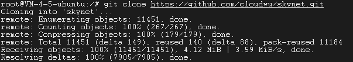
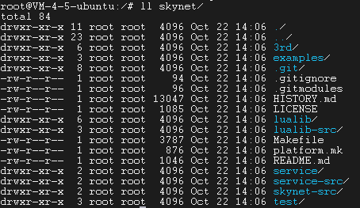
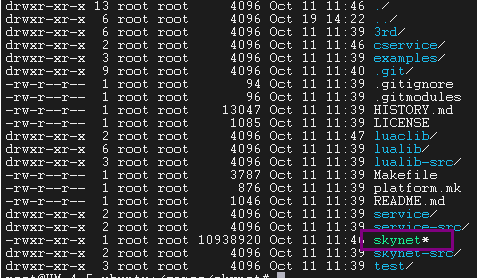
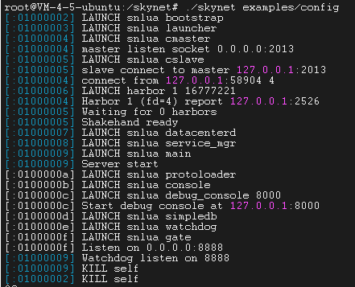
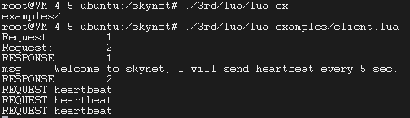

# skynet
## 网址链接
[https://blog.csdn.net/qq769651718/article/details/79432793?spm=1001.2014.3001.5501]
## skynet简介
skynet是单进程多线程模型
每个服务都是消息驱动的，以一个统一的callback函数的形式交给框架。工作线程从消息队列里调度出接收的服务模块，找到callback函数入口，调用它。
服务本身在没有被调度时，是不消耗任何CPU的

skyne框架必须保证
1. 一个服务的callbackS永远不会被并发。
2. 一个服务向另一个服务发送的消息的次序是严格保证的。

skynet中每个服务都有一个消息队列，消息由三部分构成：源地址、目的地址、以及数据块。框架启动固定的多条工作线程，每条工作线程不断从消息队列取到消息，调用服务的callback函数

做为核心功能，skynet仅解决一个问题：
把一个符合规范的C模块，从动态库(.so)文件中启动起来，绑定一个永不重复（即使模块退出）的数字id做为其handle。模块被称为服务(service)，服务间可以自由发送消息。每个模块可以向skynet框架注册一个callback函数，用来接收发送给它的消息。每个服务都是被一个个消息驱动，当没有消息到达的时候，它们就会处于挂起状态，对CPU资源零消耗。如果需要自主逻辑，则可以利用skynet系统提供的timer消息，定时触发。
## Actor模型
Actor模型内部的状态由它自己维护即它的内部数据只能由它自己修改（通过消息传递来进行状态修改），所以使用Actor模型进行并发编程可以很好的避免并下环境下的锁和内存原子性等问题。

Actor由状态(state)、行为(behavior)和邮箱(MailBox)三部分组成
1. 状态(State)：Actor中的状态是指Actor对象的变量信息，状态由actor自己管理，避免并发环境下的锁和内存原子性等问题
2. 行为(Behavior)：行为是指的是Actor中计算逻辑，通过Actor接收到的消息来改变Actor的状态
3. 邮箱(MailBox)：邮箱是Actor和Actor之间的通信桥梁，邮箱内部通过FIFO消息队列来存储发送方Actor消息，接收方Actor从邮箱队列中获取消息

Actor的基础就是消息传递，Skynet中每个服务就是一个Lua虚拟机，就是一个Actor

Actor模型优点:
1. 事件模型驱动：Actor之间的通信是异步的，即使Actor在发送消息后也无需阻塞或者等待就能处理其他事情。
2. 强隔离性：Actor中的方法不能由外部直接调用，所有的一切都通过消息进行传递，从而避免了Actor之间的数据共享，想要观察到另一个Actor的状态变化只能通过消息传递进行询问
3. 位置透明：无论Actor地址是在本地还是在远程主机上对于代码来说都是一样的。
4. 轻量性：Actor是非常轻量的计算单元，只需少量内存就能达到高并发。

## 2. 在ubuntu上搭建Skynet
### 2.1 下载skynet源码
```
git https://github.com/cloudwu/skynet.git
``` 
### 2.2 编译与运行skynet
#### 2.2.1 下载skynet
```
git clone https://github.com/cloudwu/skynet.git
```


#### 2.2.2 skynet目录结构
```
3rd              -- 第3方支持库，包括lua虚拟机，jmalloc等
lualib           -- lua语文封装的常用库，包括http,md5等
lualib-src       -- 将c语言实现的插件捆绑成lua库，例如数据库驱动、bson、加密算法
service          -- 使用lua写的Skynet的服务模块
service-src      -- 使用C写的Skynet的服务模块
skynet-src       -- skynet核心代码目录
test             -- 使用lua写的测试代码
examples         -- 示例代码
Makefile         -- 编译规则文件
platform.mk      -- 编译与平台相关的设置
```

#### 2.2.3 skynet编译
```
$ cd skynet
$ make linux
```
编译成功后目录下多了个skynet*的可执行


#### 2.2.4 运行第1个skynet节点
```
root@VM-4-5-ubuntu:/skynet# ./skynet examples/config
```


#### 2.2.5 运行客户端
```
root@VM-4-5-ubuntu:/skynet#  ./3rd/lua/lua examples/client.lua
```


## 3.构建服务的基础API
### 3.1 基础api
```lua
require "skynet"
-- 通过该函数获取注册表的变量值
skynet.getenv(varname)

-- 设置注册表信息, 但是不能设置已经存在的varname
skynet.setenv(varname, varvalue)

-- 打印函数
skynet.error(...)

-- 用 func 函数初始化服务，并将消息处理函数注册到C层，让该服务可以工作。
skynet.start(func)

-- 若服务尚未初始化完成，则注册一个函数等服务初始化阶段再执行，若服务已经初始化完成，则立刻运行该函数
skynet.init(func)

-- 结束当前服务
skynet.exit()

-- 获取当前服务的句柄handler
skynet.self()

-- 将handler转换成字符串
skynet.address(handler)

-- 退出skynet进程
-- 除了需要引入skynet包外还要再引入skynet.manager包
require "skynet.manager"

skynet.abort()

-- 强制杀死其他服务
-- 可以用来强制关闭服务。但强烈不推荐这样做。因为对象会在任意一条消息处理完毕后，毫无征兆的退出。所以推荐的做法是发送一条消息，让对方自己善后以及调用skynet.exit.
-- 注：skynet.kill(skynet.self())不完全等价于skynet.exit(),后者更安全
skynet.kill(address) 

```
### 3.2 编写一个test服务（略）
### 3.3 另外一种启动服务的模式
在终端中直接输入服务名字
### 3.4 环境变量
1. 预先加载的环境变量是在config中配置的，加载完成后，所有的service都能去获取这些环境变量
2. 也可以去设置环境变量，但是不能修改已存在的环境变量
3. 环境变量设置完成后，当前节点上的所有服务都能访问得到
4. 环境变量设置完成后，即使服务退出了，环境变量依然存在，所以不要滥用环境
## 4. 服务类型
skynet中服务分为普通服务与全局唯一服务
### 4.1 普通服务
```lua
--[[
    1. 用于启动一个新的Lua服务，luaservicename是脚本的名字（不用写.lua后缀）
    2. 只有被启动的脚本的 start 函数返回后，这个API才会返回启动的服务的地址，这是一个阻塞API
    3. 如果被启动的脚本在初始化环节抛出异常，skynet.newservicee也会执行失败
    4. 如果被启动的脚本的start是一个永不结束的循环，那么skynet.newserviice也会永远被阻塞住
]]
skynet.newserviice(luaservicename, ...)
```
每调用一次skynet.newservice就会创建出一个对应的服务实例，可以同时创建成千上万个，用唯一的id来区分每个服务实例。
### 4.2 全局唯一服务
```lua
-- 节点内唯一
skynet.uniqueservice(servicename, ...)
-- 所有节点中唯一
skynet.uniqueservice(true, servicename, ...)
```
全局唯一服务等同于单例，即不管调用多少次创建接口，最后都只会创建一个此类型的服务实例，且全局唯一
当带参数true时，则表示此服务在所有节点之间是唯一的。第一次创建唯一服时，返回服务地址，第二次创建的时候不会正常创建服务，只是返回第一次创建服务地址。
```lua
skynet.queryservice(servicename, ...)
skynet.queryservice(true, servicename, ...)
```
如果还没有创建过目标服务则一直等下去，直到目标服务被（其他服务触发）创建。
当带参数true时，则表示查询在所有节点中唯一的服务是否存在。
## 5. 服务别名
每个服务启动后，都有一个整形数据来表示id，也可以使用字符串id来表示，例如：```:01000010```，其实就是把id: ```0x01000010```转换成字符串。但是这个数据的表示方式会 根据服务的启动先后顺序而变化，不是一定固定值。如果想要方便的获取某个服务，那么可以通过难服务设置别名来表示。
在skynet中服务别名可以分为两种：
1. **本地别名：** 本地别名只能在当前skynet节点中使用，本地别名必须使用```.```开头，例如：```.testalias```
2. **全局别名：** 全局别名可以在所有skynet节点使用，全局别名不能以```.```开头，例如：```testalias```
   
### 5.1 别名注册与查询接口
```lua
local skynet = require "skynet"
require "skynet.manager"

-- 给当前服务取一个别名，可以是全局别名，也可以是本地别名
skynet.register(aliasname)
-- 给指定servicehandler的服务定一个别名，可以是全局别名，也可以是本地别名
skynet.name(aliasname, servicehandler)
-- 查询本地别名为aliasnamee的服务，返回servicehandler，不存在就返回nil
skynet.localname(aliasname)
```
## 6. 服务调度
```lua
local skynet = require "skynet"

-- 让当前等待 time * 0.01s
skynet.sleep(time)
-- 启动一个新的任务去执行函数 func，其实就是开了一个协程，函数调用完后将返回协程句柄
skynet.fork(func, ...)
-- 让出当前的任务执行流程，使本服务内其它任务有机会执行，随后会继续运行
skynet.yield()
-- 让出当前的任务执行流程，直到服wakeup唤醒它
skynet.wait()
-- 唤醒用wait或sleep处于等待状态的任务
skynet.wakeup(co)
-- 设定一个定时触发函数 func，在time * 0.01秒后触发
skynet.timeoutt(time, func)
-- 返回当前进行的启动UTC时间（秒）
skynet.starttime()
-- 返回当前进程启动后经过的时间(0.01秒)
skynet.now()
-- 通过starttime与now计算出当前UTC时间（秒）
skynet.time()
```
### 6.1 定时器的使用
skynet中的定时器，其实是通过给定时器线程注册了一个超时时间，并且占用了一个空闲协程，空闲协程也是从协程池中获取，超时后会使用空闲协程来处理超时回调函数。
启动一个定时器(skynet.timeout(time, taskFunc))只是注册一下回调函数，并不会阻塞。
其实skynet.start(func)服务启动函数实现中，就已经启动了一个timeout为0秒的定时器，来执行func。其目的就是为了让skynet工作线程调度一次新的服务。这一次调度最重要的意义在于把fork队列中的协程全部执行一遍。
## 7.服务间的通讯
### 7.1 消息类型
在skynet中消息分为多种类型，对应的也有不同的编码方式（即协议），消息类型的宏定义可以查看
```c
skynet.h
#define PTYPE_TEXT 0
#define PTYPE_RESPONSE 1  // 表示回应包消息
#define PTYPE_MULTICAST 2 // 广播消息
#define PTYPE_CLIENT 3    // 用来处理网络客户端的请求消息
#define PTYPE_SYSTEM 4    // 系统消息
#define PTYPE_HARBOR 5    // 跨节点消息
#define PTYPE_SOCKET 6    // 套接字消息
#define PTYPE_ERROR 7     // 错误消息，一般服务退出的时候会发送error消息难关联服务
#define PTYPE_QUEUE 8
#define PTYPE_DEBUG 9
#define PTYPE_LUA 10     // LUA类型的消息
#define PTYPE_SNAX 11    // snax服务消息

#define PTYPE_TAG_DONTCOPY 0x10000
#define PTYPE_GAT_ALLOCSESSION 0x20000
```
上面的消息类型有多种，但是最常用的是```PTYPE_LUA```,对应到lua层，叫做```lua消息```，大部分服务一般使用这种消息，默认情况下，```PTYPE_RESPONSE、PTYPE_ERROR、PTYPE_LUA```三种消息类型已经注册，如果想使用其它的消息类型，需要自己显式注册消息类型
### 7.2 注册消息处理函数
当我们需要在一个服务中监听指定类型的消息，就需要在服务启动的时候注册该类型的消息监听，通常是在服务的入口函数```skynet.start```处通过调用```skynet.dispatch```来注册绑定
```lua
-- 服务启动入口
skynet.start(function()
    -- 注册"lua"类型消息的回调函数
    skynet.dispatch("lua", function(session, address, ...)
        -- 消息处理,一旦注册成功国，那么只要发送给这个服务的消息是lua类型消息，都会调用我们的注册函数来进行处理
    end)
end)
```
### 7.3 打包与解包消息
skynet中的消息在发送之前必须要把参数进行打包，然后才能发送。接收方接收到消息后会自动根据指定的解包函数进行解包，最常用的打包解包函数为·```skynet.pack```与```skynet.unpack```
```skynet.pack(...)```打包后，会返回两个参数，一个是C指针指向数据包msg的起始地址，另一个sz是数据包的长度。msg指针的内存区域中动态申请的。
```skynet.unpack(msg, sz)```解包后，会返回一个参数列表。需要注意这个时候C指针msg指向的内存并不会释放掉。如果msg有实际的用途，skynet框架会帮你在合适的地方释放。
### 7.4 发送消息的方法
**发送无需响应的消息**
```lua
-- 用type类型向addr发送未打包的消息。该函数会自动把...参数列表进行打包，默认情况下lua消息使用skynet.pack打包。
-- addr可以是服务句柄，也可以是服务别名
-- 发送成功后立即返回0
skynet.send(addr, type, ...)
-- 用type类型向addr发送一个打包好的消息。addr可以是服务句柄也可以是服务别名
-- 发送成功后立即返回0
skynet.rawsend(addr, type, msg, sz)
```
**发送必须响应的消息**
```lua
-- 向addr发送type类型的未打包的消息。该函数会自动把...参数列表进行打包，默认情况下lua消息使用skynet.pack打包。
-- addr可以是服务句柄，也可以是服务别名
-- 发送成功后，该函数将阻塞等待响应返回，返回值为响应的返回值
skynet.call(addr, type, ...)
-- 向addr发送一个打包好的消息。addr可以是服务句柄，也可以是一个服务别名。
-- 发送成功后，该函数将阻塞等待响应返回，返回值为响应的返回值
skynet.rawcall(addr, type, msg, sz)
```
## 7.5 响应消息的方法
对于lua消息响应的时候，使用的是```PTYPE_RESPONSE```这种消息，也是需要打包的，打包的时候必须与接收到的消息的打包方法一致。
```lua
-- 目标服务消息处理后需要通过该函数将结果返回
skynet.ret()
-- 将消息服skynet.packr打包，并调用skynet.ret回应
skynet.retpack()
```
注：
1. 应答消息打包的时候，打包方法必须与接收消息的打包方法一致
2. skynet.ret()不需要指定应答消息是给哪个服务的。因为每次接收到消息时，服务都会启动一个协程来处理，并把这个协程与源服务地址绑定在一起了（其实就是把协程句柄作为key，源服务地址为value，记录在一张表中）。需要响应的时候可以根据协程句柄找到源服务地址。
## 7.6 session的意义
session只有在使用skynet.call或skynet.rawcall发送消息的时候才有意义
因为有可能一个服务开了多个协程去call消息，然后多个协程都在等待应答消息，回来了一个应答，到底唤醒哪个协程，就可以通过session来判断了，skynet中的session能保证本服务中发出的消息是唯一的。消息与响应一一对应。
## 7.7 使用skynet.response响应消息
在使用skynet.ret()或skynet.retpack()进行应答时，必须要保证与接收请求时在同一个协程中（源服务地址与协程句柄已经一一对应）也就是说在哪个协程接收的请求也必须在这个协程去做响应。
在skynet中，当一个服务收到一个消息时，会启动一个协程来处理，并且把协程句柄与发送消息的服务地址进行一一对应记录在table中，当需要响应时，就使用当前调用```skynet.ret()```的协程句柄去查询对应服务地址，然后把这个消息发送给这个服务地址。如果一个开了一个新的协程去调用```skynet.ret()```，那么这个时候使用新启动的协程句柄去查询服务地址，肯定是查询不到的。
当不想接收请求与响应请求在同一个协程中完成时，可以使用```skynet.response()```代替```skynet.ret()```
```lua
local skynet = require "skynet"
-- 参数pack指定应答打包函数，不填默认使用skynet.pack，必须与接收到的消息的打包函数一致
-- 返回值是一个闭包函数
local response = skynet.response(pack)
-- 闭包函数使用方式
-- ok: "test": 表示检查接收响应的服务是否存在
--      true：表示发送应答PTYPE_RESPONSE
--      false：表示发送PTYPE_ERROR错误消息
response(ok, ...)
```
注：把发送服务地址以及session打包到闭包中，就可以在任意地方调用了。
## 7.8 skynet.call失败的情况
## 7.9 服务重入问题
同一个skynet服务中的一条消息处理中，如果调用了一个阻塞API，那么它会被挂起。挂起过程中，这个服务可以响应其它消息。这可能造成时序问题，要非常小心处理
换句话说，一旦你的消息处理过程中有外部请求，那么先到的浙江省上未必比后到的消息先处理完。且每个阻塞调用后，服务的内部状态都未必和调用前的一致（因为别的消息处理过程可能改变状态）
## 7.10 服务临界区
skynet.queue模块可以帮助你回避这些服务重入或者伪并发引起的复杂性。
```lua
local queue = require "skynet.queue"
-- 获取一个执行队列
local cs = queue()
-- 将f丢到队列中去执行
-- 队列将依次执行第一个函数，前一个函数还没执行完的时候，后面的函数永远不会执行
cs(f, ...)
```
注：执行队列虽然解决了重入问题，但是明显降低了服务的并发处理能力，所以使用执行队列的时候尽量缩小临界区的颗粒度大小。
### 7.11 注册其它类型的消息
## 8 Multicast组播
### 8.1 Multicast介绍
引入```skynet.multicast```模块后，可以使用skynet的组播方案。你可以自由创建一个频道，并可以向其中投递任意消息。频道订阅者可以收到投递的消息。
```lua
local mc = require "skynet.multicast"
-- 创建一个新的频道，成功创建后，channel.channel就是这个频道的id
local channel = mc.new()

```
